# UKF要解决的问题

## roadmap

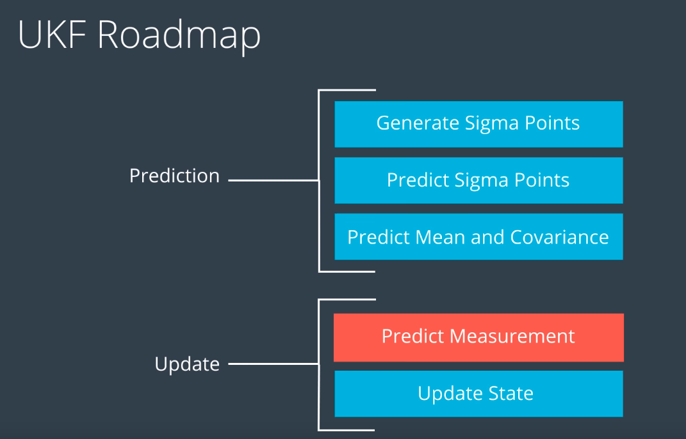

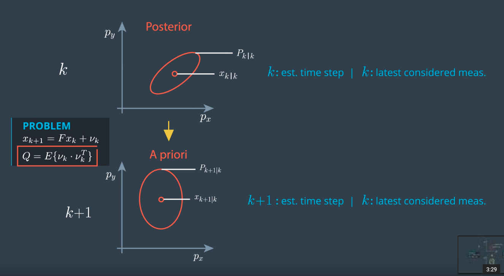

目的：用k步的值预测k+1步我们要干什么。

## 这个预测过程就需要用到我们的积分来计算

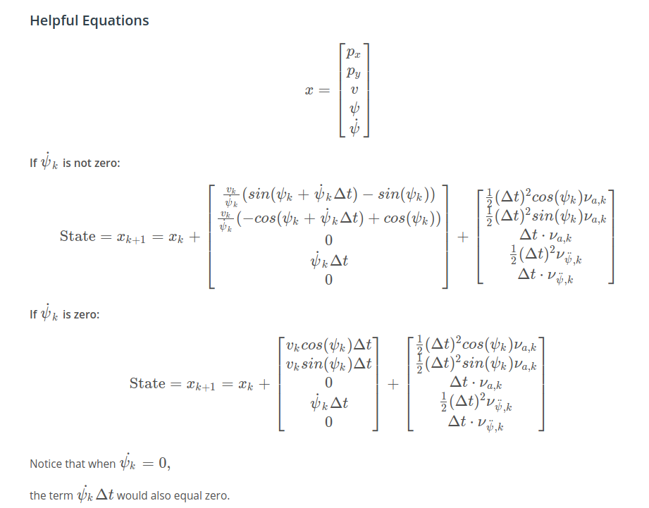

## sigma point 选择

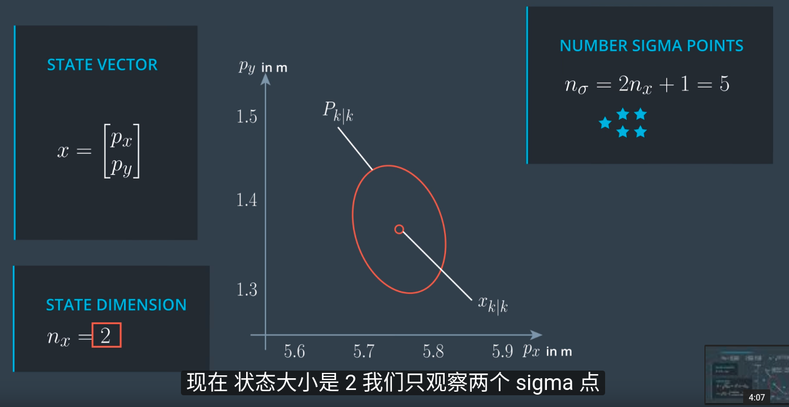

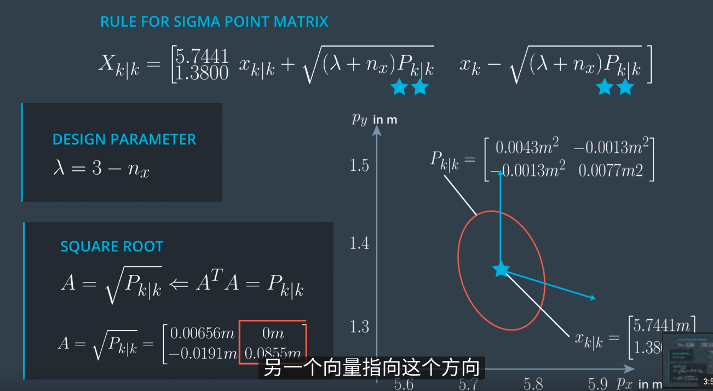

2~n+1有n个点

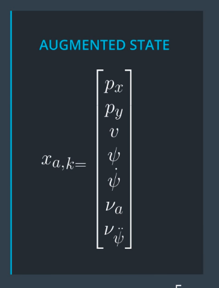

因为噪音的计算是非线性的，所以我们也需要把噪音加进`X_state`里面来结算sigma point

## 选完->计算完->计算mean and cov for prediction

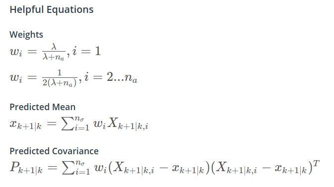

这里的$$$n_a$$$是非线性转换之前的维度

## measurement prediction

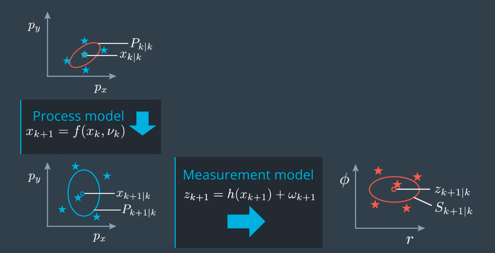

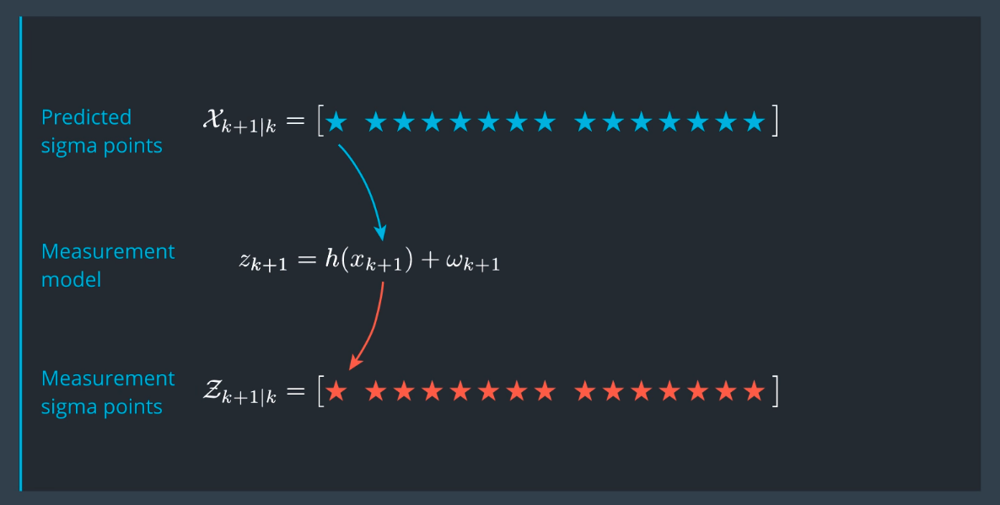

直接使用prediction得出的sigma point做空间转换

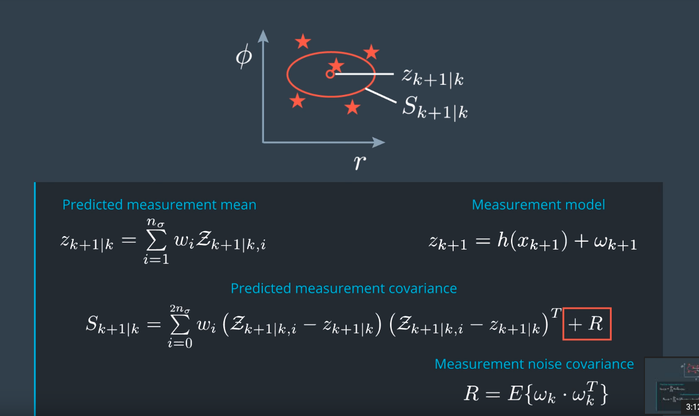

转换之后，通过分配权重求出新分布的均值还有方差。注意不确定因素R不用做augmentation，因为它不是prediction部分的`加速度`或者`加加速度`具有时间积累因素，它只是简单的一个bias

## ukf update

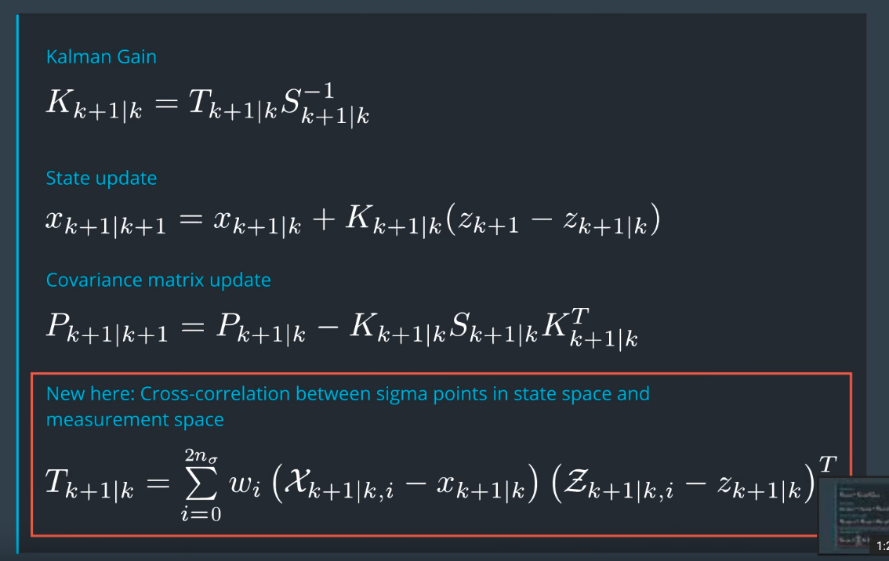
Kalman gain 部分的T矩阵有部分更改

## noise tuning

我们要保证值大部分在两倍sigma里面

**对于measurement noise R 商家提供方差，而不需要我们调整**

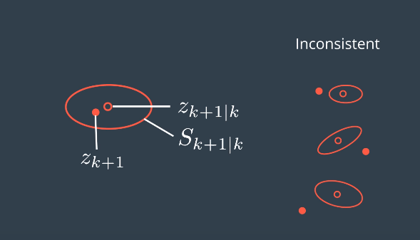

低估了误差的影响

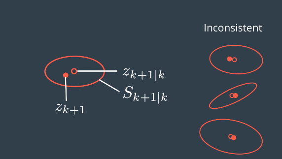

高估了误差的影响

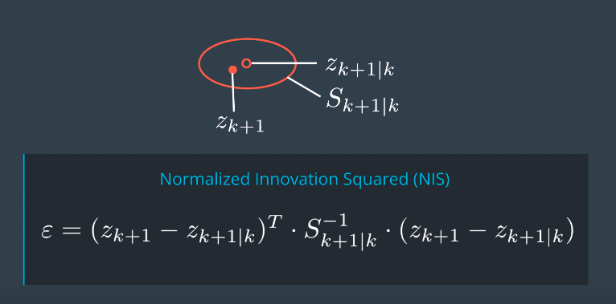

检测一致性的公式。最后求出的nis只是一个标准化之后的数值

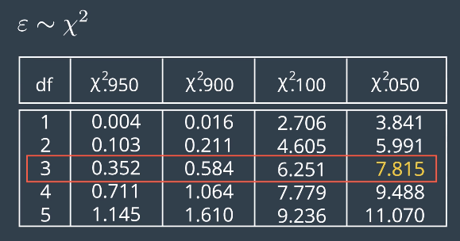

要使得数值95%是正确的，我们要使得nis大部分低于7.815

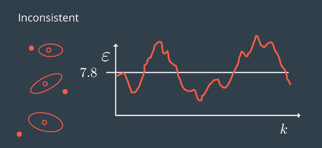

这是误差设置小了，圆圈不能包着real measurement

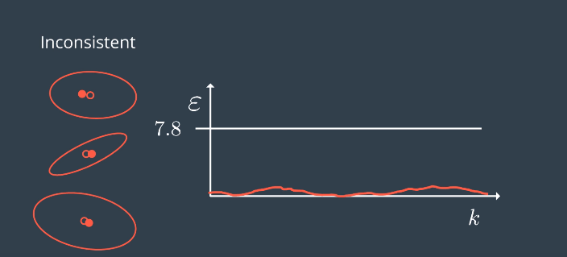

高误差，包得死死的，看不出任何偏差的信息跟实际也不符合啊

## 初始化需要注意的点

- 位置根据第一次measurement的值更新
- covariance matrix用单位矩阵更新